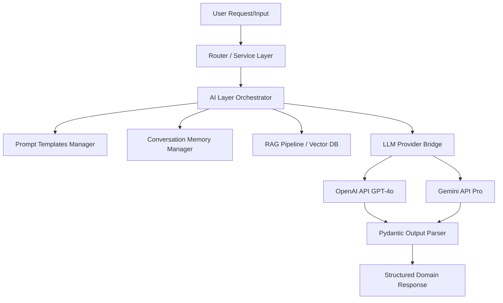
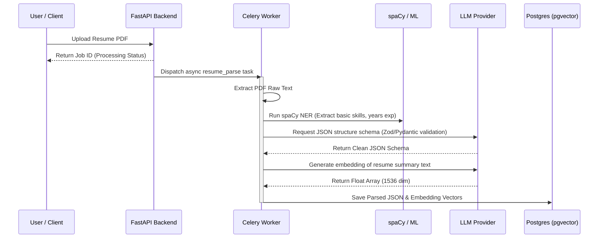

# 🤖 AI & Machine Learning Architecture Document

This document outlines the AI and Machine Learning components, pipeline workflows, prompt templates, vector configurations, and NLP processing strategies utilized in CareerPilot AI.

---

## 1. AI Layer Architecture

Our AI architecture is designed to remain provider-agnostic. We use **LangChain** to orchestrate LLM calls, handle chat context, and structure input/output parameters via Pydantic output parsers.



### 1.1 Provider Interface

The `apps/api/ai/providers.py` defines an abstract interface class `BaseLLMProvider`. Concrete implementations (e.g., `OpenAIProvider`, `GeminiProvider`) implement synchronous and asynchronous methods.

```python
# Interface Sketch
class BaseLLMProvider(ABC):
    @abstractmethod
    async def generate(self, prompt: str, system_instruction: str = None, **kwargs) -> str:
        pass

    @abstractmethod
    async def generate_structured(self, prompt: str, output_schema: Type[BaseModel], **kwargs) -> BaseModel:
        pass
```

### 1.2 Conversation Memory

For the Chat Assistant and Interview Simulator, memory must be maintained:

- **Database Backed:** Chat and Interview history is stored in Postgres (`chat_message` and `interview_message`).
- **Context Injection:** When an AI session starts, the service layer retrieves the last $N$ messages (bounded context length) and formats them into a LangChain `ChatPromptTemplate` to avoid token bloat while maintaining conversational flow.

---

## 2. RAG & Resume Intelligence Pipeline

The RAG (Retrieval-Augmented Generation) pipeline processes uploaded resumes and maps them against current career taxonomies.



---

## 3. Core AI/ML Modules

### 3.1 Resume Intelligence

- **Task:** Parses contact info, work history, skills, education, projects, and certifications from unstructured text.
- **LLM Prompt Strategy:** Uses Structured Outputs (e.g., Json Schema mode in OpenAI/Gemini) with strict typing constraints to map data into Pydantic models.

### 3.2 Career Recommendation Engine

- **Task:** Recommends roles based on profiles and current industry trends.
- **Hybrid Search:** Combines keyword search (BM25) on PostgreSQL text indexes with Vector Cosine Similarity Search (using pgvector index) matching user resume embeddings with target role description embeddings.

### 3.3 Dynamic Roadmap Generator

- **Task:** Analyzes the gap between a user's current skill profile and the target role description, then produces an ordered sequence of learning steps.
- **Input:** User Profile Skills + Target Role Required Skills.
- **Processing:** Checks the difference to isolate missing skills, uses a directed graph database logic to structure prerequisite links, and queries LLMs to supply curated learning goals and resources for each milestone.

### 3.4 Interview Simulator

- **Task:** Simulates realistic technical/behavioral interview environments.
- **Evaluation Loop:** Each user message response is evaluated on three dimensions:
  1. **Relevance:** Did they answer the question asked?
  2. **Technical Depth:** Did they mention correct keywords, frameworks, or design patterns?
  3. **Communication Style:** Was it professional and structured (e.g., STAR method)?
- **WebSocket Gateway:** Integrates streaming APIs to allow real-time voice-to-text processing for an immersive simulator experience.

---

## 4. Machine Learning Infrastructure

The `ml/` directory contains local CPU/GPU-friendly models designed to handle parsing and sorting pipelines efficiently.

### 4.1 Data Processing & Feature Engineering (`ml/processing.py`)

- Clean tokenizers, stopword removers, and custom lemmatizers optimized for technical terms (e.g., distinguishing "Go" the language from "go" the verb).
- Entity extraction configurations using **spaCy** custom pipeline models trained to recognize tech stacks and job titles (NER - Named Entity Recognition).

### 4.2 Skill Classification (`ml/classifier.py`)

- Standardizes unstructured, user-submitted skill names into a canonical taxonomy (e.g., mapping "React JS", "React.js", "React Native" to normalized tag objects).
- Uses **Sentence Transformers** to generate token-level embeddings and cluster synonyms.

### 4.3 Recommendation Ranking (`ml/ranker.py`)

- Traditional ranking heuristics might bias recommendations toward keyword matches. Our ranker uses a **Scikit-learn** model (e.g., Random Forest or XGBoost wrapper) that computes a score based on:
  - Vector similarity distance.
  - Years of relevant experience.
  - Completed roadmaps.
  - Matching skills ratio.
- The scoring model is trained offline and executed inline as a fast inference layer step.
