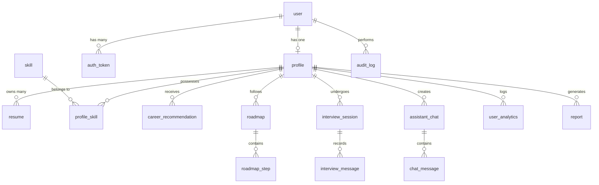

# 🗄️ Database Architecture & Design Document

This document defines the schema, table schemas, relations, indexing strategies, and constraints for the CareerPilot AI platform database.

---

## 1. Database Architecture & Design Decisions

- **Engine:** PostgreSQL 16+
- **Extensions:**
  - `uuid-ossp` for UUID v4 primary keys.
  - `pgvector` for resume and job matching embedding vectors.
- **Conventions:**
  - All tables use singular snake_case names (e.g., `user`, `resume`).
  - Auditing: All tables contain `created_at` and `updated_at` timestamps.
  - Soft Deletes: Tables like `user` and `resume` implement `is_deleted` flags to preserve historical analytics data.

---

## 2. Core Modules & Table Schemas

### 2.1 Users & Authentication Module

Manages logins, password security, session validation, and account statuses.

#### Table: `user`

- `id`: `UUID` (Primary Key, default: `uuid_generate_v4()`)
- `email`: `VARCHAR(255)` (Unique, Not Null)
- `hashed_password`: `VARCHAR(255)` (Not Null)
- `is_active`: `BOOLEAN` (Default: `true`)
- `is_superuser`: `BOOLEAN` (Default: `false`)
- `role`: `VARCHAR(50)` (Default: `'user'`, Constraints: `user`, `premium_user`, `admin`)
- `created_at`: `TIMESTAMP WITH TIME ZONE` (Default: `now()`)
- `updated_at`: `TIMESTAMP WITH TIME ZONE` (Default: `now()`)

#### Table: `auth_token`

Stores active refresh tokens and token revocation lists.

- `id`: `UUID` (Primary Key)
- `user_id`: `UUID` (Foreign Key -> `user.id` ON DELETE CASCADE)
- `token_jti`: `VARCHAR(255)` (Unique, index for quick lookups)
- `expires_at`: `TIMESTAMP WITH TIME ZONE` (Not Null)
- `is_revoked`: `BOOLEAN` (Default: `false`)

---

### 2.2 Profiles & Resume Module

Tracks demographic data, work history, target jobs, resume parsing structures, and embeddings.

#### Table: `profile`

- `id`: `UUID` (Primary Key)
- `user_id`: `UUID` (Foreign Key -> `user.id` ON DELETE CASCADE, Unique)
- `first_name`: `VARCHAR(100)`
- `last_name`: `VARCHAR(100)`
- `target_role`: `VARCHAR(100)`
- `current_experience_level`: `VARCHAR(50)` (e.g., `entry`, `mid`, `senior`, `lead`)
- `embedding_vector`: `VECTOR(1536)` (Holds LLM-generated profile preference embedding)
- `updated_at`: `TIMESTAMP WITH TIME ZONE` (Default: `now()`)

#### Table: `resume`

Stores parsed fields, file references, and intelligence metadata.

- `id`: `UUID` (Primary Key)
- `profile_id`: `UUID` (Foreign Key -> `profile.id` ON DELETE CASCADE)
- `file_url`: `VARCHAR(512)` (Not Null)
- `raw_text`: `TEXT`
- `parsed_json`: `JSONB` (Stores structured skills, experience, and education details)
- `resume_embedding`: `VECTOR(1536)` (Vector embedding of processed resume summary)
- `is_active`: `BOOLEAN` (Default: `true`)
- `created_at`: `TIMESTAMP WITH TIME ZONE`

---

### 2.3 Skills & Career Recommendations Module

Maintains skill directories, evaluates gap matrices, and generates career recommendations.

#### Table: `skill`

- `id`: `UUID` (Primary Key)
- `name`: `VARCHAR(100)` (Unique, Index)
- `category`: `VARCHAR(50)` (e.g., `'frontend'`, `'ml'`, `'management'`)

#### Table: `profile_skill`

Many-to-many relationship mapping skills to user profiles.

- `profile_id`: `UUID` (Foreign Key -> `profile.id` ON DELETE CASCADE)
- `skill_id`: `UUID` (Foreign Key -> `skill.id` ON DELETE CASCADE)
- `confidence_score`: `DECIMAL(3,2)` (Scale: 0.00 to 1.00, representing self/ML-assessed proficiency)
- Primary Key: `(profile_id, skill_id)`

#### Table: `career_recommendation`

- `id`: `UUID` (Primary Key)
- `profile_id`: `UUID` (Foreign Key -> `profile.id` ON DELETE CASCADE)
- `role_title`: `VARCHAR(100)`
- `match_score`: `DECIMAL(3,2)` (Percentage fit based on embeddings and skill-gap)
- `reasoning`: `TEXT` (AI-generated logic)
- `market_demand_trend`: `VARCHAR(50)`
- `created_at`: `TIMESTAMP WITH TIME ZONE`

---

### 2.4 Roadmaps & Learning Assistant Module

Maps out milestones, skill gaps, and learning resources to reach a target role.

#### Table: `roadmap`

- `id`: `UUID` (Primary Key)
- `profile_id`: `UUID` (Foreign Key -> `profile.id` ON DELETE CASCADE)
- `target_role`: `VARCHAR(100)`
- `status`: `VARCHAR(50)` (e.g., `'active'`, `'completed'`, `'archived'`)
- `created_at`: `TIMESTAMP WITH TIME ZONE`

#### Table: `roadmap_step`

Nodes within the dynamic roadmap tree.

- `id`: `UUID` (Primary Key)
- `roadmap_id`: `UUID` (Foreign Key -> `roadmap.id` ON DELETE CASCADE)
- `parent_step_id`: `UUID` (Self-referential Foreign Key -> `roadmap_step.id`, Nullable)
- `title`: `VARCHAR(150)` (Not Null)
- `description`: `TEXT`
- `target_skill_id`: `UUID` (Foreign Key -> `skill.id`, Nullable)
- `order_index`: `INTEGER` (Not Null)
- `is_completed`: `BOOLEAN` (Default: `false`)

---

### 2.5 Interview Simulator & Chat History Module

Tracks conversational mock interview simulators, feedback reports, and user-AI prompts.

#### Table: `interview_session`

- `id`: `UUID` (Primary Key)
- `profile_id`: `UUID` (Foreign Key -> `profile.id` ON DELETE CASCADE)
- `role_target`: `VARCHAR(100)`
- `difficulty`: `VARCHAR(50)` (e.g., `'medium'`, `'hard'`)
- `overall_feedback`: `TEXT` (AI evaluation summary)
- `overall_score`: `INTEGER` (0 - 100)
- `created_at`: `TIMESTAMP WITH TIME ZONE`

#### Table: `interview_message`

- `id`: `UUID` (Primary Key)
- `session_id`: `UUID` (Foreign Key -> `interview_session.id` ON DELETE CASCADE)
- `role`: `VARCHAR(50)` (Constraints: `system`, `user`, `assistant`)
- `content`: `TEXT`
- `evaluation_metrics`: `JSONB` (Specific score, grammar feedback, context accuracy for this message reply)
- `created_at`: `TIMESTAMP WITH TIME ZONE`

#### Table: `assistant_chat`

Generic AI-career coach conversation threads.

- `id`: `UUID` (Primary Key)
- `profile_id`: `UUID` (Foreign Key -> `profile.id` ON DELETE CASCADE)
- `title`: `VARCHAR(255)`
- `created_at`: `TIMESTAMP WITH TIME ZONE`

#### Table: `chat_message`

- `id`: `UUID` (Primary Key)
- `chat_id`: `UUID` (Foreign Key -> `assistant_chat.id` ON DELETE CASCADE)
- `role`: `VARCHAR(50)` (Constraints: `user`, `assistant`)
- `content`: `TEXT`
- `created_at`: `TIMESTAMP WITH TIME ZONE`

---

### 2.6 Analytics, Reports & Administration Module

Tracks application-wide user interactions, performance metrics, and administrative activities.

#### Table: `user_analytics`

Tracks user milestones (e.g., roadmaps completed, resumes uploaded, matches found).

- `id`: `UUID` (Primary Key)
- `profile_id`: `UUID` (Foreign Key -> `profile.id` ON DELETE CASCADE)
- `metric_type`: `VARCHAR(100)` (e.g., `'interview_completed'`, `'skills_acquired'`)
- `value`: `INTEGER`
- `captured_date`: `DATE` (Default: `current_date`)

#### Table: `report`

Stores generated PDF reports summarizing career profiles and recommendations.

- `id`: `UUID` (Primary Key)
- `profile_id`: `UUID` (Foreign Key -> `profile.id` ON DELETE CASCADE)
- `report_type`: `VARCHAR(50)` (e.g., `'career_audit'`, `'skills_report'`)
- `file_url`: `VARCHAR(512)`
- `created_at`: `TIMESTAMP WITH TIME ZONE`

#### Table: `audit_log`

Enterprise-wide security and administration action audits.

- `id`: `UUID` (Primary Key)
- `actor_id`: `UUID` (Foreign Key -> `user.id` ON DELETE SET NULL, Nullable for system tasks)
- `action`: `VARCHAR(100)` (e.g., `'USER_REVOKED'`, `'EXPORT_DATA'`)
- `ip_address`: `VARCHAR(45)`
- `details`: `JSONB` (Stores state transitions or error logs for review)
- `created_at`: `TIMESTAMP WITH TIME ZONE` (Default: `now()`)

---

## 3. Relationships & Cardinality



---

## 4. Indexing & Optimization Strategy

1. **Foreign Key Indexes:**
   Foreign key fields (`user_id`, `profile_id`, `roadmap_id`, etc.) are indexed by default to ensure rapid join queries during dashboard aggregation queries.

   ```sql
   CREATE INDEX idx_profile_user_id ON profile(user_id);
   CREATE INDEX idx_resume_profile_id ON resume(profile_id);
   CREATE INDEX idx_roadmap_profile_id ON roadmap(profile_id);
   ```

2. **JSONB Indexes:**
   The `parsed_json` column in `resume` uses a **GIN (Generalized Inverted Index)** to query deeply nested skills and job experience structures efficiently.

   ```sql
   CREATE INDEX idx_resume_parsed_json_gin ON resume USING gin (parsed_json);
   ```

3. **Vector Similarity Index:**
   To scale our RAG pipelines and career matching algorithms, we apply an **HNSW (Hierarchical Navigable Small World)** vector index using cosine distance (`vector_cosine_ops`) for rapid embedding retrieval.

   ```sql
   CREATE INDEX idx_profile_emb_hnsw ON profile USING hnsw (embedding_vector vector_cosine_ops);
   CREATE INDEX idx_resume_emb_hnsw ON resume USING hnsw (resume_embedding vector_cosine_ops);
   ```

4. **Composite Indexes:**
   Composite index on `profile_skill(profile_id, skill_id)` facilitates instant lookup of skill matrix configurations.
