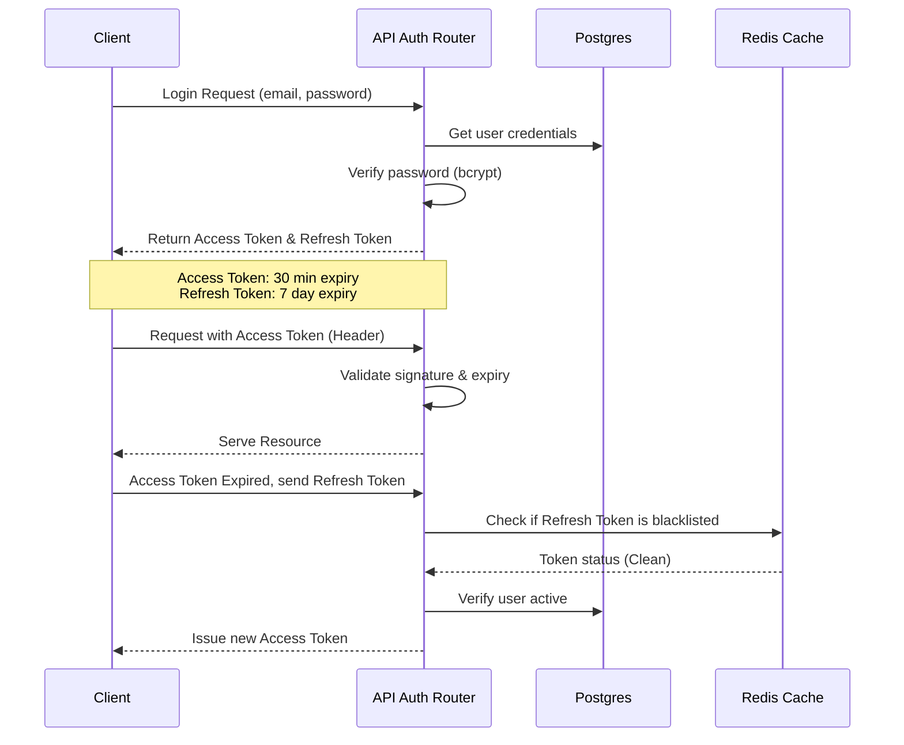

# 🔒 Security Architecture & Policy Document

This document outlines the security architecture, controls, threat mitigation plans, and standards implemented in CareerPilot AI.

---

## 1. Authentication & Session Management

We use a stateless token-based session management system utilizing JWT (JSON Web Tokens).



### 1.1 Access Tokens & Refresh Tokens
- **Access Tokens:** Signed with HMAC-SHA256 using `JWT_SECRET`. Lifetime is restricted to **30 minutes**. Contains the user ID (`sub`) and role permission scopes.
- **Refresh Tokens:** Life-limited to **7 days**. Stored in the database (`auth_token` table) and referenced via a secure HTTP-only cookie.
- **Revocation List:** If a user logs out, their Refresh Token is marked as revoked in the database and its JTI (JWT ID) is written to a Redis blocklist with a TTL matching its remaining lifetime.

### 1.2 Password Hashing
- Passwords are encrypted before database insertion using **bcrypt** (via `passlib` with a cost factor of 12).
- Plaintext passwords are never logged, stored, or cached.

---

## 2. Authorization & RBAC (Role-Based Access Control)

Access checks are executed inside FastAPI routing endpoints using security dependencies:

```python
# Usage Example inside Routers
@router.get("/admin/metrics")
async def get_admin_metrics(
    current_user: User = Depends(get_current_active_superuser)
):
    ...
```

### Roles Matrix
- **User (`user`):** Standard access. Can upload resumes, review their profiles, request roadmaps, and initiate mock interviews.
- **Premium User (`premium_user`):** Access to advanced features (e.g., unlimited audio mock interviews, priority career RAG scans).
- **Admin (`admin`):** Access to management metrics, global user audits, and system configuration endpoints.

---

## 3. Rate Limiting

To prevent brute force, scraping, and LLM token exhaustion:
- **Implementation:** Custom FastAPI Middleware utilizing a Redis token-bucket mechanism.
- **Rules:**
  - Standard API requests: Limit to **100 requests per minute** per IP address.
  - Auth endpoints (`/login`, `/signup`): Limit to **5 requests per minute** per IP address.
  - LLM/AI intensive endpoints (`/resume/parse`, `/roadmap/generate`): Limit to **5 requests per minute** per authenticated user.

---

## 4. Input Validation & Sanitization

Injection flaws are prevented by design:
- **Zod (Frontend):** Strictly validates forms before sending payloads to APIs, rejecting malformed JSON.
- **Pydantic v2 (Backend):** Validates and sanitizes types on request bodies. Fields representing HTML or scripts are escaped.
- **SQLAlchemy (ORM):** All database operations run through SQLAlchemy's parameterized queries to mitigate SQL Injection risks.

---

## 5. Audit Logging

Every security-sensitive event (e.g., failed logins, role upgrades, profile exports, data deletions) generates an entry in the `audit_log` table:
- Log components: Actor ID, IP address, Action classification, timestamp, and metadata payload.
- Logs are write-once; updating or deleting logs via standard API routers is strictly prohibited.
- Production logs are streamed directly to external monitoring aggregators (e.g., Sentry, CloudWatch) for tamper-evident retention.
